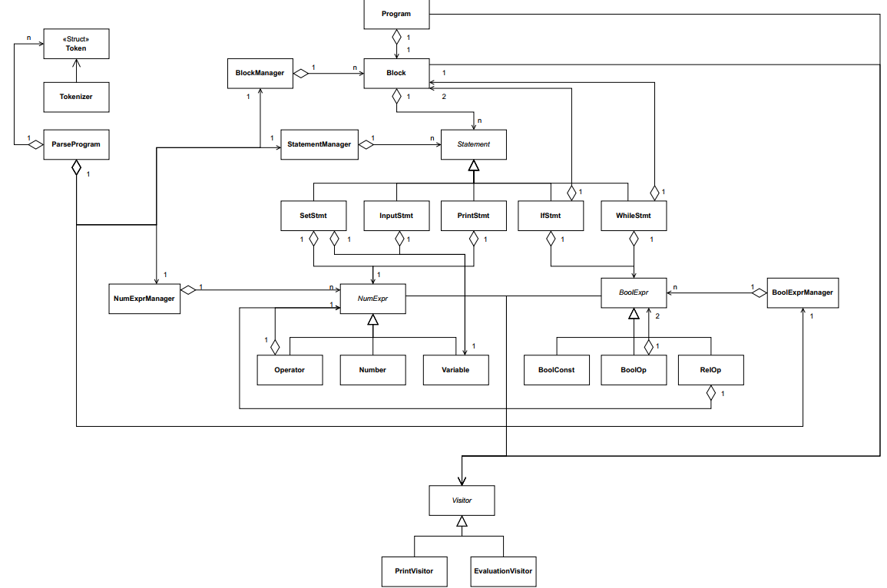
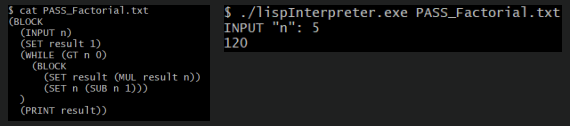

# lisp-like-interpreter
Interpreter development in C++ for LISP-like language:
- LISP-like program contains variable definitions, input/output instructions, conditional and loop statements and is limited to operations involving integer-type variables
- Interpreter operations:
  - Read a file containing the program to be interpreted; the syntax of the program is defined by an unambiguous context-free grammar
  - Execute the program contained in the source file
  - Ask through console for any data input provided by the input instructions and display on the console the result of expressions provided by the output instructions

<hr>

### USAGE
```
./lispInterpreter.exe [path to the file with lisp code]
```

<hr>

### GRAMMAR
<b>PROGRAM</b>
<pre>
program        → stmt_block 
stmt_block     → statement | ( <b>BLOCK</b> statement_list ) 
statement_list → statement statement_list | statement 
</pre>

<b>STATEMENT</b>
<pre>
statement → variable_def | io_stmt | cond_stmt | loop_stmt

variable_def → ( <b>SET</b> variable_id num_expr )
io_stmt      → ( <b>PRINT<b> num_expr ) | ( <b>INPUT<b> variable_id )
cond_stmt    → ( <b>IF<b> bool_expr stmt_block stmt_block )
loop_stmt    → ( <b>WHILE<b> bool_expr stmt_block )
</pre>

<b>NUMERICAL EXPRESSION<b>
<pre>
num_expr → ( <b>ADD<b> num_expr num_expr ) | ( <b>SUB<b> num_expr num_expr ) | ( <b>MUL<b> num_expr num_expr ) 
         | ( <b>DIV<b> num_expr num_expr ) | <b>number<b> | <b>variable_id<b>
</pre>

<b>BOOLEAN EXPRESSION<b>
<pre>
bool_expr → ( <b>LT<b> num_expr num_expr ) | ( <b>GT<b> num_expr num_expr ) | ( <b>EQ<b> num_expr num_expr ) 
          | ( <b>AND<b> bool_expr bool_expr ) | ( <b>OR<b> bool_expr bool_expr ) | ( <b>NOT<b> bool_expr ) | <b>TRUE<b> | <b>FALSE<b>
</pre>

<b>VARIABLE<b>
<pre>
variable_id → alpha_list
alpha_list  → alpha alpha_list | alpha
alpha       → <b>a<b> | <b>b<b> | <b>c<b> | . . . | <b>z<b> | <b>A<b> | <b>B<b> | <b>C<b> | . . . | <b>Z<b>
</pre>

<b>NUMBERS<b>
<pre>
number    → - posnumber | posnumber
posnumber → <b>0<b> | sigdigit rest
sigdigit  → <b>1<b> | . . . | <b>9<b>
rest      → digit rest | <b>ε<b>
digit     → <b>0<b> | sigdigit
</pre>

<hr>

### UML


<hr>

### FACTORIAL EXAMPLE

# lisp-like-interpreter
Interpreter development in C++ for LISP-like language:
- LISP-like program contains variable definitions, input/output instructions, conditional and loop statements and is limited to operations involving integer-type variables
- Interpreter operations:
  - Read a file containing the program to be interpreted; the syntax of the program is defined by an unambiguous context-free grammar
  - Execute the program contained in the source file
  - Ask through console for any data input provided by the input instructions and display on the console the result of expressions provided by the output instructions

<hr>

### USAGE
```
./lispInterpreter.exe [path to the file with lisp code]
```

<hr>

### GRAMMAR
<b>PROGRAM</b>
<pre>
program        → stmt_block 
stmt_block     → statement | ( <b>BLOCK</b> statement_list ) 
statement_list → statement statement_list | statement 
</pre>

<b>STATEMENT</b>
<pre>
statement → variable_def | io_stmt | cond_stmt | loop_stmt

variable_def → ( <b>SET</b> variable_id num_expr )
io_stmt      → ( <b>PRINT</b> num_expr ) | ( <b>INPUT</b> variable_id )
cond_stmt    → ( <b>IF</b> bool_expr stmt_block stmt_block )
loop_stmt    → ( <b>WHILE</b> bool_expr stmt_block )
</pre>

<b>NUMERICAL EXPRESSION</b>
<pre>
num_expr → ( <b>ADD</b> num_expr num_expr ) | ( <b>SUB</b> num_expr num_expr ) | ( <b>MUL</b> num_expr num_expr ) 
         | ( <b>DIV</b> num_expr num_expr ) | <b>number</b> | <b>variable_id</b>
</pre>

<b>BOOLEAN EXPRESSION</b>
<pre>
bool_expr → ( <b>LT</b> num_expr num_expr ) | ( <b>GT</b> num_expr num_expr ) | ( <b>EQ</b> num_expr num_expr ) 
          | ( <b>AND</b> bool_expr bool_expr ) | ( <b>OR</b> bool_expr bool_expr ) | ( <b>NOT</b> bool_expr ) | <b>TRUE</b> | <b>FALSE</b>
</pre>

<b>VARIABLE<b>
<pre>
variable_id → alpha_list
alpha_list  → alpha alpha_list | alpha
alpha       → <b>a</b> | <b>b</b> | <b>c</b> | . . . | <b>z</b> | <b>A</b> | <b>B</b> | <b>C</b> | . . . | <b>Z</b>
</pre>

<b>NUMBERS</b>
<pre>
number    → - posnumber | posnumber
posnumber → <b>0</b> | sigdigit rest
sigdigit  → <b>1</b> | . . . | <b>9</b>
rest      → digit rest | <b>ε</b>
digit     → <b>0</b> | sigdigit
</pre>

<hr>

### UML


<hr>

### FACTORIAL EXAMPLE

